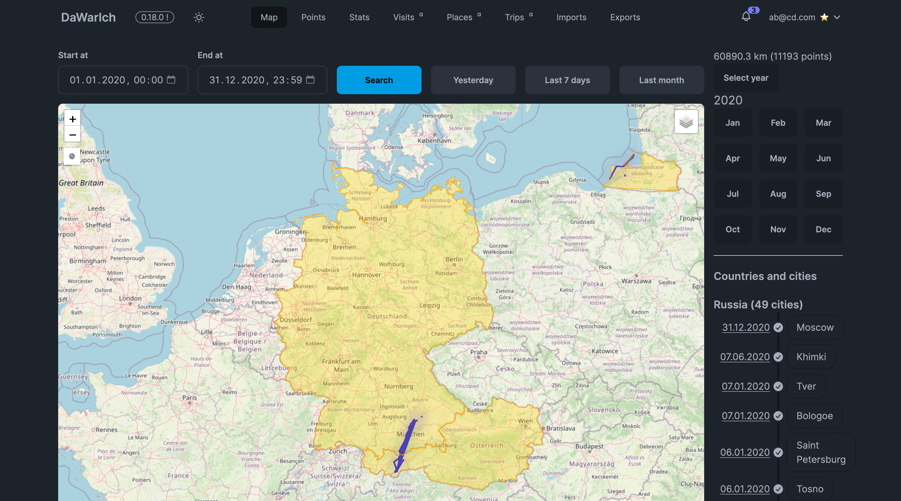

Hi and welcome to the November 2024 monthly update of Dawarich!

November was a good month for Dawarich. I've added a lot of new features and fixed a some bugs. Let's dive into the details!

## Important features and changes

## The Trips release

You can now create, edit and delete trips. To create a trip, click on the "New Trip" button on the Trips page. Provide a name, date and time for start and end of the trip. You can add your own notes to the trip as well.

If you have points tracked during provided timeframe, they will be automatically added to the trip and will be shown on the trip map.

Also, if you have Immich integrated, you will see photos from the trip on the trip page, along with a link to look at them on Immich.

<iframe width="560" height="315" src="https://www.youtube.com/embed/XLE0X2NEPEE?si=mRks_UNEr6AMOQ0u" title="YouTube video player" frameborder="0" allow="accelerometer; autoplay; clipboard-write; encrypted-media; gyroscope; picture-in-picture; web-share" referrerpolicy="strict-origin-when-cross-origin" allowfullscreen></iframe>

## The Immich Photos release

With this release, Dawarich can now show photos from your Immich instance on the map.

To enable this feature, you need to provide your Immich instance URL and API key in the Settings page. Then you need to enable "Photos" layer on the map (top right corner).

An important note to add here is that photos are heavy and hence generate a lot of traffic. The response from Immich for specific dates is being cached in Redis for 1 day, and that may lead to Redis taking a lot more space than previously. But since the cache is being expired after 24 hours, you'll get your space back pretty soon.

<iframe width="560" height="315" src="https://www.youtube.com/embed/iElDmu0iQUY?si=7EXI6OUTOyZ2W8te" title="YouTube video player" frameborder="0" allow="accelerometer; autoplay; clipboard-write; encrypted-media; gyroscope; picture-in-picture; web-share" referrerpolicy="strict-origin-when-cross-origin" allowfullscreen></iframe>


The other thing worth mentioning is how Dawarich gets data from Immich. It goes like this:

1. When you click on the "Photos" layer, Dawarich will make a request to `GET /api/v1/photos` endpoint to get photos for the selected timeframe.
2. This endpoint will make a request to `POST /search/metadata` endpoint of your Immich instance to get photos for the selected timeframe.
3. The response from Immich is being cached in Redis for 1 day.
4. Dawarich's frontend will make a request to `GET /api/v1/photos/:id/thumbnail.jpg` endpoint to get photo thumbnail from Immich. The number of requests to this endpoint will depend on how many photos you have in the selected timeframe.
5. For each photo, Dawarich's frontend will make a request to `GET /api/v1/photos/:id/thumbnail.jpg` endpoint to get photo thumbnail from Immich. This thumbnail request is also cached in Redis for 1 day.

## The Websockets release

This one is more about QoL, making your UI more alive. Notifications, new points on the map, imports now won't require page reloading to see an update, they will just be on your page dynamically.

## Scratch map release

Yeah, you can now enable the "Scratch Map" layer on the map. Have a look:



## Changelog

### Added

- The Trips feature.
- If you have provided your Immich instance URL and API key, the map will now show photos from your Immich instance when Photos layer is enabled.
- `GET /api/v1/photos` endpoint added to get photos from Immich.
- `GET /api/v1/photos/:id/thumbnail.jpg` endpoint added to get photo thumbnail from Immich.
- Admins can now see all users in the system on the Users page. The path is `/settings/users`.
- New notifications are now being indicated with a blue-ish dot in the top right corner of the screen. Hovering over the bell icon will show you last 10 notifications.
- New points on the map will now be shown in real-time. No need to reload the map to see new points.
- User can now enable or disable Live Mode in the map controls. When Live Mode is enabled, the map will automatically move to the new points as they are being added to the map.
- Scratch map. You can enable it in the map controls. The scratch map highlight countries you've visited. The scratch map is working properly only if you have your points reverse geocoded.
- `GET /api/v1/countries/borders` endpoint to get countries for scratch map feature
- Dawarich now can export metrics to Prometheus. You can find the metrics at `your.host:9394/metrics` endpoint. The metrics are being exported in the Prometheus format and can be scraped by Prometheus server. To enable exporting, set the `PROMETHEUS_EXPORTER_ENABLED` env var in your docker-compose.yml to `true`. Example:

```diff
  dawarich_app:
    image: freikin/dawarich:latest
    container_name: dawarich_app
    environment:
      ...
+     PROMETHEUS_EXPORTER_ENABLED: "true"
```


### Fixed

- Retrieving photos from Immich now using `takenAfter` and `takenBefore` instead of `createdAfter` and `createdBefore`. With `createdAfter` and `createdBefore` Immich was returning no items some years.
- Retrieving photos from Immich now correctly handles cases when Immich returns no items. It also logs the response from Immich for debugging purposes.
- Exported files will now always have an extension when downloaded. Previously, the extension was missing in case of GPX export.
- Deleting and sorting points on the Points page will now preserve filtering and sorting params when points are deleted or sorted. Previously, the page was being reloaded and filtering and sorting params were lost.
- Exported GPX file now being correctly recognized as valid by Garmin Connect, Adobe Lightroom and (probably) other services. Previously, the exported GPX file was not being recognized as valid by these services.
- Speed is now being recorded into points when a GPX file is being imported. Previously, the speed was not being recorded.
- GeoJSON file from GPSLogger now can be imported to Dawarich. Previously, the import was failing due to incorrect parsing of the file.


### Changed

- Maps are now not so rough on the edges.
- Rate limit for the Photon API is now 1 request per second. If you host your own Photon API instance, reverse geocoding requests will not be limited.
- Requests to the Photon API are now have User-Agent header set to "`Dawarich #{APP_VERSION} (https://dawarich.app)`"
- Default number of Puma workers is now 2 instead of 1. This should improve the performance of the application. If you have a lot of users, you might want to increase the number of workers. You can do this by setting the `WEB_CONCURRENCY` env var in your `docker-compose.yml` file. Example:

```diff
  dawarich_app:
    image: freikin/dawarich:latest
    container_name: dawarich_app
    environment:
      ...
      WEB_CONCURRENCY: "2"
```

- `PROMETHEUS_EXPORTER_HOST` and `PROMETHEUS_EXPORTER_PORT` env vars were added to the `docker-compose.yml` file to allow you to set the host and port for the Prometheus exporter. They should be added to both `dawarich_app` and `dawarich_sidekiq` services Example:

```diff
  dawarich_app:
    image: freikin/dawarich:latest
    container_name: dawarich_app
    environment:
      ...
      PROMETHEUS_EXPORTER_ENABLED: "true"
+     PROMETHEUS_EXPORTER_HOST: 0.0.0.0
+     PROMETHEUS_EXPORTER_PORT: "9394"

  dawarich_sidekiq:
    image: freikin/dawarich:latest
    container_name: dawarich_sidekiq
    environment:
      ...
      PROMETHEUS_EXPORTER_ENABLED: "true"
+     PROMETHEUS_EXPORTER_HOST: dawarich_app
+     PROMETHEUS_EXPORTER_PORT: "9394"
```
- Dawarich now uses `POST /api/search/metadata` endpoint to get geodata from Immich.
- Admins can now provide custom password for new users and update passwords for existing users on the Users page.
- The `bin/dev` file will no longer run `bin/rails tailwindcss:watch` command. It's useful only for development and doesn't really make sense to run it in production.
- The Vists suggestion job is disabled. It will be re-enabled in the future with a new approach to the visit suggestion process.

---

## Conclusion

What a month huh? Feel free to reach out to me on [X](https://x.com/freymakesstuff), [Mastodon](https://mastodon.social/@dawarich) or [Discord server](https://discord.gg/pHsBjpt5J8) if you have any questions or suggestions.

You can also support the project by sponsoring it on [Patreon](https://www.patreon.com/freika), [Ko-Fi](https://ko-fi.com/freika) or [Github Sponsors](https://github.com/sponsors/Freika) ✨

Thank you and see you in the next monthly update!

