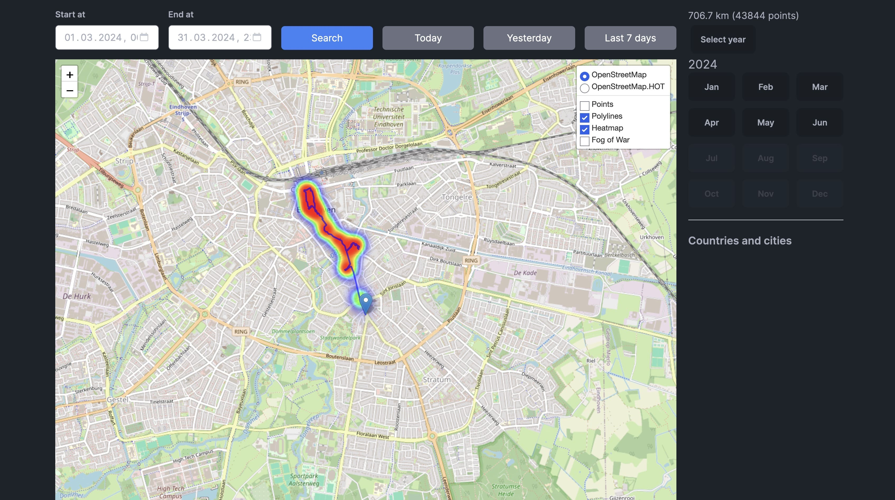
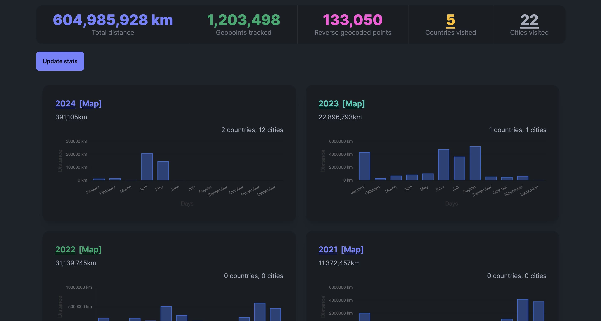
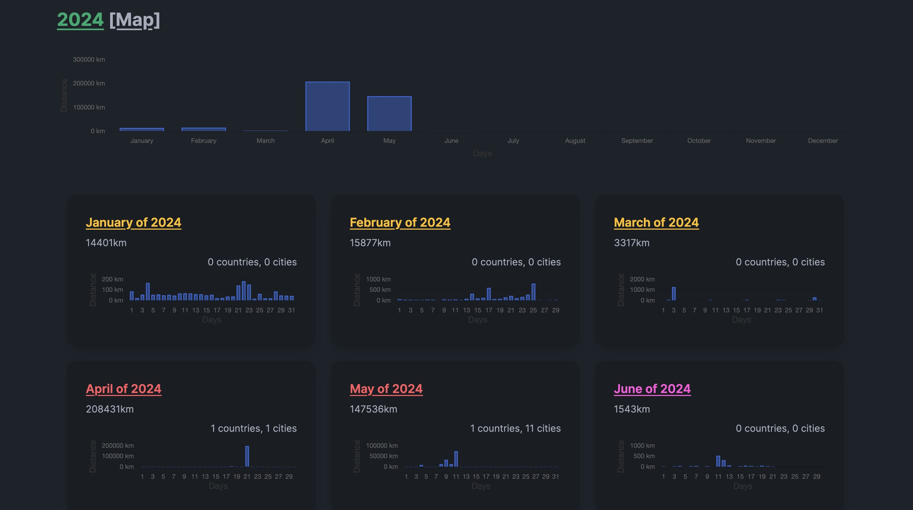
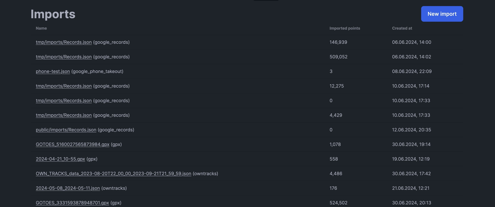

# Features overview

## Tracking location history

You can set up your own location tracking system using combination of Dawarich and Overland or OwnTracks. Refer to [Track your location tutorial](./tutorials/track-your-location) for more information on how to set up your own location tracking system. When a mobile application (Overland or OwnTracks) is set up to send data to Dawarich, you can see your location history on the map, as well as in the form of points and routes.

## Map

Map page features a map with visualizations of your data. You can see your points, routes, heatmap, and fog of war. You can also change the map layers and see the sidebar with your points. Points, routes, heatmap and fog of war can be toggled on and off for better visibility.

To see the details of a point, click on it. A popup will appear with the point's information. To see the details on a route, hover over it and a popup will appear with the route's information.

You can select time range for the data you want to see on the map.

In the sidebar you can find navigation by year and month, as well as a information on your visits to different countries and cities.

## Points

Points page features a list of your points. You can search for points providing a time range, export them to a JSON file, and delete them. To export points, select the time range, click "Search", and then click the "Export" button. Export will be done in background and you can find the result on the Exports page.

To delete points, select points you want to delete.

## Stats

Stats page features a summary of your data, as well as stats by year and by month. You can also update your stats. Click "Update stats" to update your stats. The update will be done in background and usually takes a few minutes to complete.

Click on a year to see stats for that year. Click on a `[Map]` link to see the points on the map for that year. On the year's page, if you click on a month, you will see points for that on the map.

## Imports

Imports page features a list of your imports. For each import, you can see the name, number of points imported, and the time of the import. Click on the import name to see the details of the import. On import's individual page you can also delete the import, which will ⚠️ *delete all points imported in that import* ⚠️.

On the Imports page you can also create a new import. Refer to [Imports tutorial](./tutorials/import-existing-data) for more information.

## Exports

Exports page features a list of your exports. For each export, you can see the name, status, and the time of the export. When exporting process is finished, you'll see a download link.

