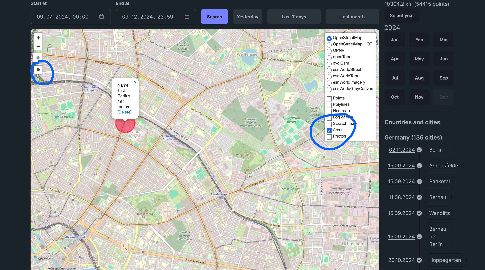

# Areas

If you're frequently visiting the same area, you can create an area in Dawrich and it will be shown on the map. The main purpose of areas is to help you track your visits to the same area. Every day at midnight, Dawrich will check if you've visited the area today and if you have, it will suggest a visit to the area in the [Visits](/docs/features/visits-and-places) page.

To create an area, enable the "Areas" layer in the [Map](/docs/features/map) page and then click on the "Create area" button. A popup will appear where you can draw the area. You can draw a rectangle, a circle or a polygon.

⚠️ Important: If an area is being destroyed, all visits to the area will be deleted as well.
