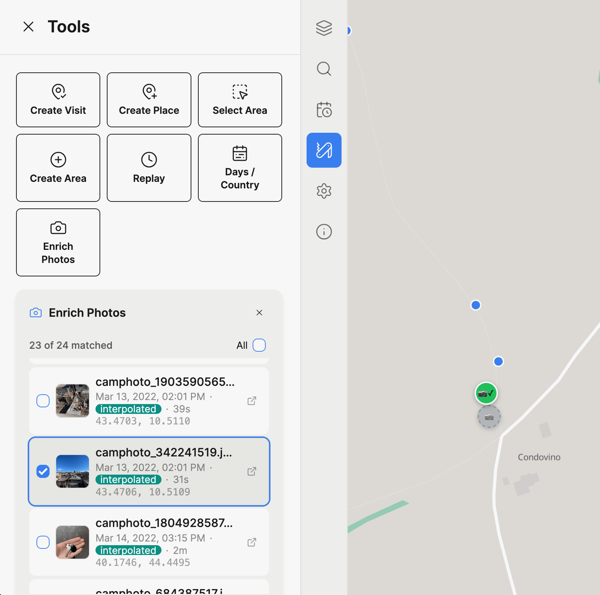
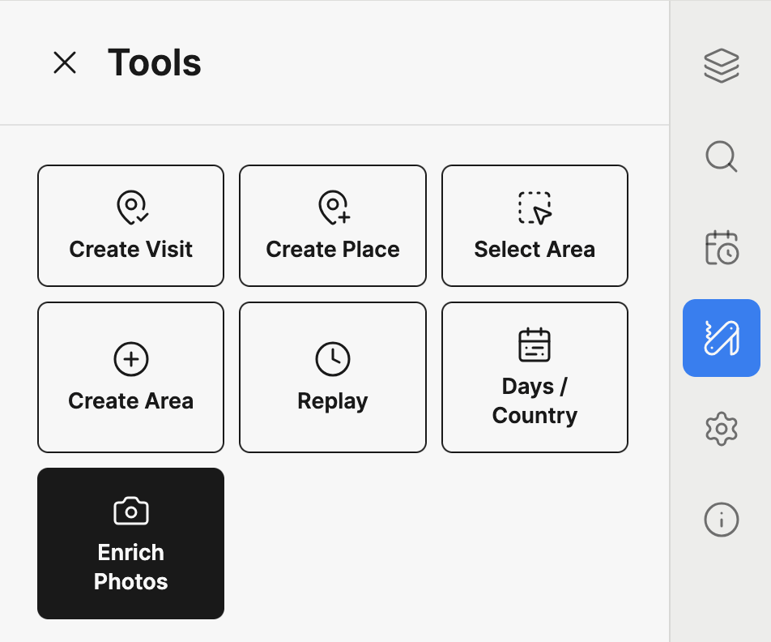
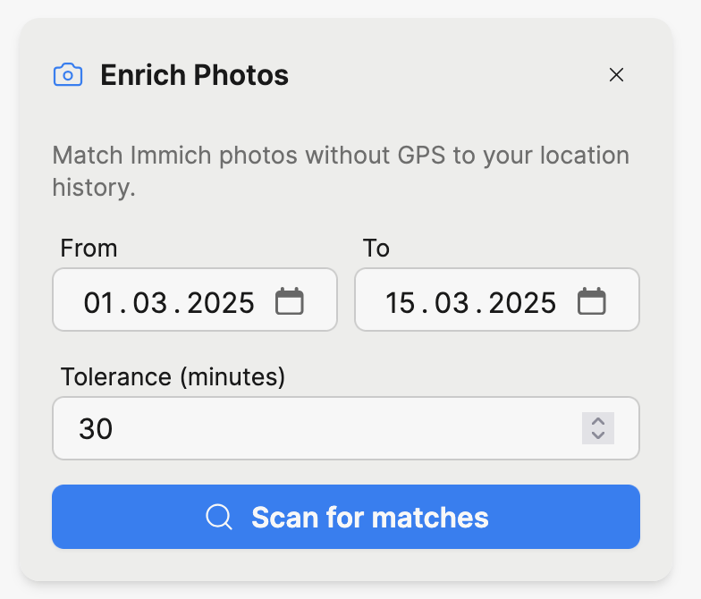

# Enrich Immich Photos

If you have photos in Immich that were taken without GPS (e.g. from a camera without location services), Dawarich can enrich them with coordinates from your location history. The feature matches photos by timestamp to your tracked points and writes the GPS data back to Immich.

This is the reverse of importing geodata from Immich &mdash; instead of reading coordinates from photos, you're writing them.

## Requirements

- An Immich integration configured in **Settings > Integrations**
- An Immich API key with the following permissions:
  - `asset.read` &mdash; to search for photos
  - `asset.view` &mdash; to display thumbnails
  - `asset.update` &mdash; to write coordinates back to photos
- Location data in Dawarich covering the time period of the photos
- Pro plan or self-hosted instance

:::info
Enriching only updates the coordinates in Immich's database. It does **not** modify the EXIF data in your original photo files.
:::

## How to use

### 1. Open the Enrich Photos tool

Navigate to the Map (v2) page, open the sidebar panel, and switch to the **Tools** tab. Click the **Enrich Photos** button.

### 2. Configure and scan

Set the **date range** for the photos you want to enrich. The dates default to the range currently displayed on the map.

Set the **tolerance** in minutes. This is the maximum time difference between a photo's timestamp and a Dawarich point for them to be considered a match. The default is 30 minutes.

Click **Scan for matches**.

### 3. Review matches

After scanning, you'll see a list of matched photos with:

- A **thumbnail** preview (hover for a larger view)
- The photo's **date and time**
- The **time delta** between the photo and the matched location point
- The **match method**: `interpolated` (calculated between two surrounding points) or `nearest` (closest single point)
- The proposed **coordinates**
- A **link** to open the photo in Immich

Each matched photo also appears as a **draggable marker** on the map. Markers are color-coded by confidence:

| Color  | Time delta  | Confidence |
|--------|-------------|------------|
| Green  | &lt; 5 min  | High       |
| Yellow | 5 &ndash; 15 min | Medium |
| Orange | &gt; 15 min | Lower      |

You can:

- **Click a list item** to fly to that photo's location on the map
- **Click a map marker** to highlight the corresponding list item
- **Drag a marker** to adjust the coordinates before enriching
- **Uncheck photos** you don't want to enrich &mdash; unchecked photos appear as gray markers on the map
- **Use "All"** to select or deselect all photos at once

### 4. Enrich

Once you're happy with the selection and coordinates, click **Enrich N photos**. Dawarich will write the coordinates to Immich for each selected photo.

A success or warning message will appear when the operation completes.

:::tip
Running the scan again after enriching will return fewer results, since the newly enriched photos now have GPS data and are automatically excluded.
:::

## How matching works

For each photo without GPS data, Dawarich finds the best location match:

1. **Interpolation** (preferred): If there are tracked points both before and after the photo's timestamp within the tolerance window, Dawarich calculates the position by linear interpolation based on the time fraction between the two points.

2. **Nearest point** (fallback): If only one nearby point exists within the tolerance, that point's coordinates are used directly.

3. **No match**: If no tracked points exist within the tolerance window, the photo is skipped.

## Troubleshooting

| Issue | Solution |
|-------|----------|
| "Immich URL is missing" or "Immich API key is missing" | Configure the Immich integration in **Settings > Integrations** |
| No photos found | Verify the date range covers a period with photos in Immich |
| Photos found but no matches | Ensure you have Dawarich location data for the same time period, or increase the tolerance |
| Enrichment fails with permission error | Ensure your Immich API key has the `asset.update` permission |
| Coordinates seem wrong | Drag the marker to the correct position before enriching, or reduce the tolerance for tighter matches |
