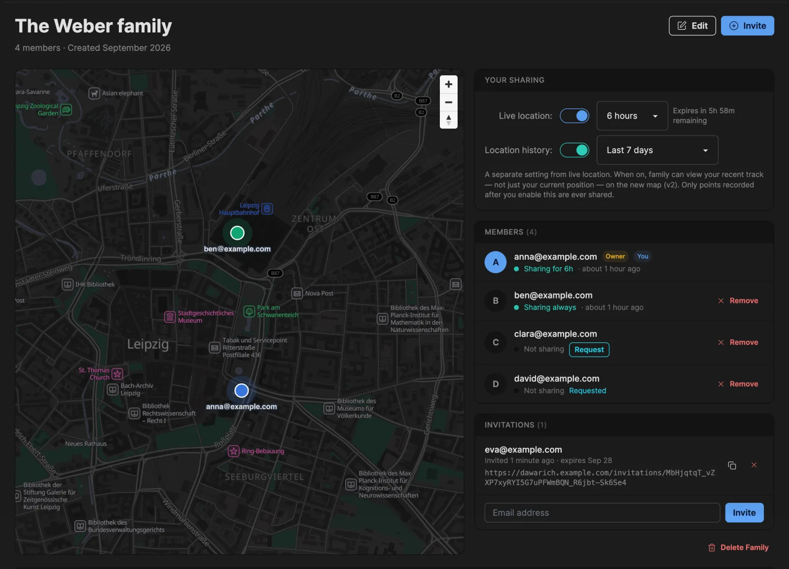
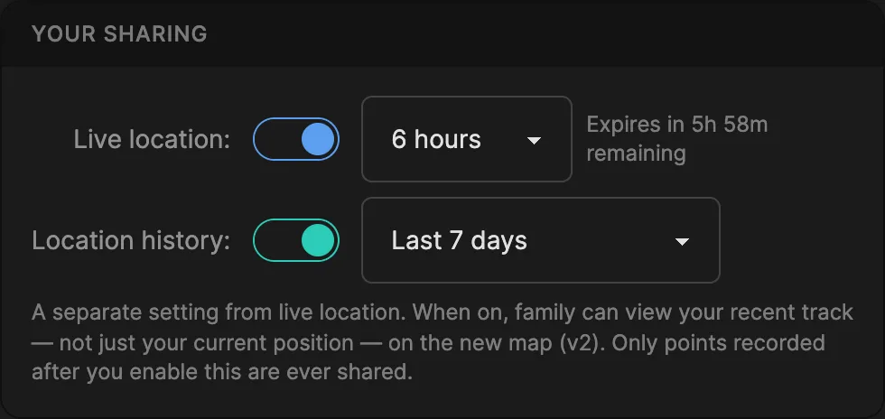
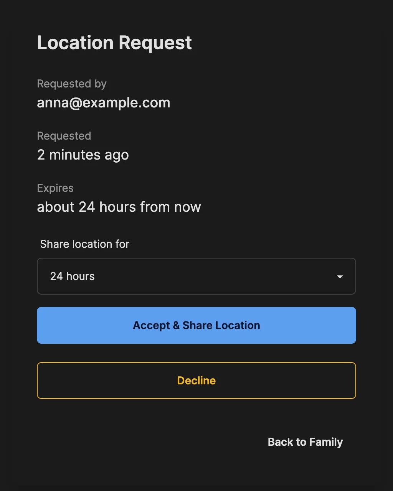
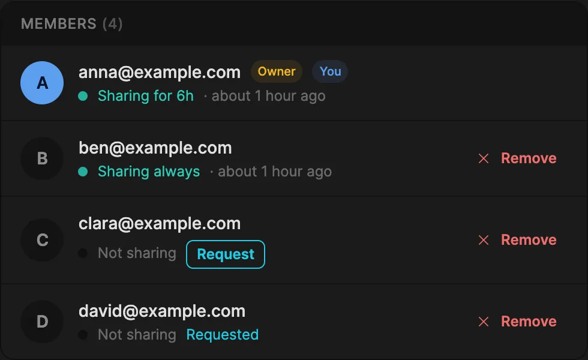
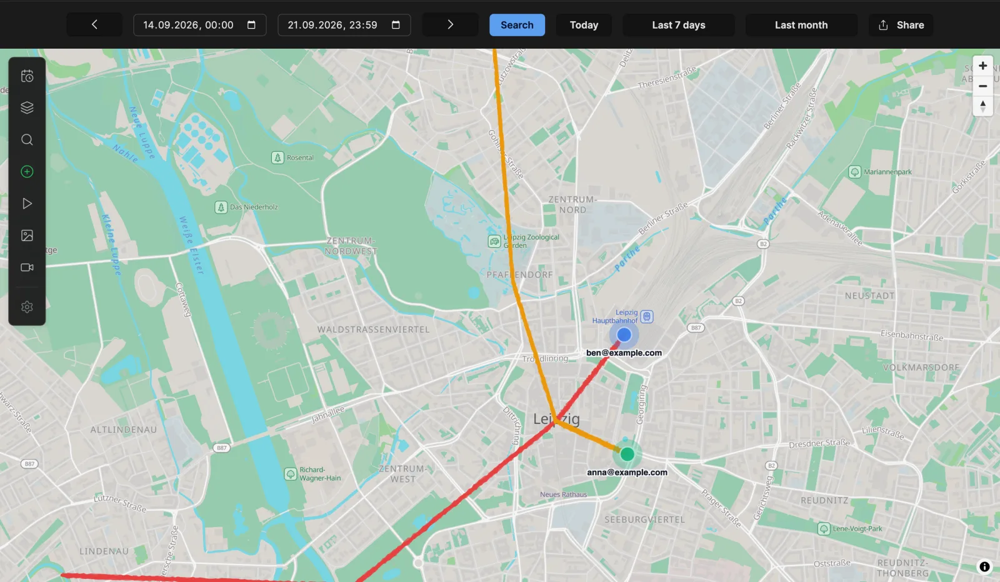

# Family Location Sharing

Family lets a small group of people see each other on the map. Every member keeps their own Dawarich account, with their own map, timeline and statistics. Nothing is shared until a member switches it on themselves, and there are two separate choices:

- **Live location**: your current position, optionally on a timer.
- **Location history**: your recent track, within a time window you choose.

Family is available on **self-hosted** instances for everyone, with no plan and no member limit, and on **Dawarich Cloud** through the [Family plan](#family-plan-dawarich-cloud).

## Family plan (Dawarich Cloud)

On Dawarich Cloud, owning a family requires the **Family plan**. It is one annual subscription that covers a whole household:

- **€299.99 / year**, annual billing only, with a 7-day free trial.
- **Up to 5 members in total**: the owner plus up to 4 people. Pending invitations count towards the 5.
- **Every member gets full Pro access** while the plan is active: unlimited history, heatmap, Fog of War, globe view, photo integrations and the full write API. Invited members do **not** need a subscription of their own, and signing up from an invitation skips the checkout.
- **Members with their own subscription keep it.** The family never changes a plan somebody pays for themselves.
- **Your data is never deleted.** Leaving a family, being removed or the plan ending never removes a single point. Everything stays in each member's account and can be exported.

### Starting the plan

When you start the Family plan, including the trial, Dawarich creates your family for you. It is called **My Family**, your live location sharing is already switched on, and you get a notification that the family is ready. You can rename it from **Edit** on the Family page.

Until you invite someone, the Family page shows a short getting-started panel with an invitation form.

### Upgrading to Family

If you are on Lite or Pro, you can switch to Family from your subscription page; Paddle charges a prorated amount for the remainder of your current period.

### When the plan ends

If the owner cancels, a payment fails or the trial runs out, the family itself is kept:

- **Access lasts until the end of the period that is already paid for.** This also applies when the owner switches from Family to another plan in the meantime.
- **After that, members without their own subscription lose access.** Their account falls back to Lite, and tracking and uploads pause until a plan is active again. Each of them gets one email explaining what happened. Their history stays in their account and can be exported.
- **Family features pause for everyone.** The Family page shows *Family plan no longer active*, the owner sees a **Renew Family plan** button, and pending invitations cannot be accepted until the plan is renewed.
- **Privacy actions keep working.** Anyone can still turn their own sharing off or leave the family, and the owner can still remove members or delete the family.

Renewing the plan restores access for every member at once.

:::info
Self-hosted instances have every family feature, with no plan and no limit on the number of members.
:::

## Creating a family

On Dawarich Cloud, the family is created automatically when you start the Family plan (see above). On a self-hosted instance:

1. Click **Family** in the navigation bar
2. Enter a name for your family (up to 50 characters)
3. Click **Create Family**

You become the owner of the family. Each person can be in one family at a time.

## Inviting members

Only the owner can invite people:

1. Go to the **Family** page
2. Enter the person's email address in the **Invitations** section (or in the getting-started panel, if you are still alone in the family)
3. Click **Invite**

Dawarich emails the invitation. Each pending invitation also shows its link with a copy button, so you can send it yourself, for example on a self-hosted instance without [SMTP](/docs/self-hosting/configuration/smtp). Invitations are valid for **7 days** and can be cancelled at any time.

:::tip
An invitation only works for the email address it was sent to. The invited person has to sign in, or create their account, with that exact address.
:::

## Accepting an invitation

1. Open the invitation link
2. Sign in, or create an account with the invited email address
3. Click **Accept Invitation & Join Family**

If you are already in another family, leave it first. If the family's plan is not active, the invitation can be accepted once the owner renews it.

## Your sharing settings

Your settings are in the **Your Sharing** section of the Family page. Only you can change them. The owner has no control over anyone else's sharing, and turning your own sharing off always works, even after the family's plan has ended.

### Live location

Switch on **Live location** and choose how long to share:

- **Always**: until you switch it off
- **1 hour**, **6 hours**, **12 hours** or **24 hours**: sharing switches itself off when the time is up, and the remaining time is shown next to the setting

While it is on, your family sees your latest recorded position.

### Location history

**Location history** is a separate setting that becomes available once live location is on. When it is on, your family can see your recent track on the map, not only your current position. Choose how far back:

- **Last 24 hours**
- **Last 7 days** (default)
- **Last 30 days**
- **Since sharing started** (up to one year back)

By default, only points recorded after you started sharing are included. In the [mobile apps](#in-the-mobile-apps) you can additionally allow earlier history within the chosen window.

Turning live location off also turns history off. When you switch sharing on again, it starts afresh: history is off until you enable it, and only points recorded from that moment on are shared.

## Location requests

Instead of tracking someone, you can ask them. Next to every member who is not sharing, the member list shows a **Request** button. Any member can send a request, not only the owner.

The person you asked gets a notification in Dawarich and an email. They can:

- **Accept & Share Location**: choose a duration (24 hours is preselected, and 1, 6, 12 hours or permanently are also offered). This switches on their live location, exactly as if they had turned it on themselves. It does not switch on their location history.
- **Decline**, or simply ignore it. A request expires after **24 hours**.

While your request is waiting, the member list shows **Requested** next to that person. You cannot send a request to someone who is already sharing, or send a second request to the same person within an hour.

## Members

For every member the list shows:

- Their email address, and whether they are the **Owner** or **You**
- Their sharing status: *Sharing always*, *Sharing for 6h*, or *Not sharing*
- When their latest shared position was recorded
- **Request** or **Requested** (see [Location requests](#location-requests))
- **Remove**, for the owner

When your own location is being shared, a green dot appears next to **Family** in the navigation bar.

## Seeing your family on the map

- **Family page**: the map shows the current position of every member who is sharing.
- **Map v2**: open **Map Layers** and switch on **Family Members**. Positions update in real time. For members who share their history, their track is drawn for the dates selected on the map.

### In the mobile apps

The [iOS](/docs/dawarich-for-ios) and [Android](/docs/dawarich-for-android) apps show your family in a panel on the map. There you can see who is in your family and who is sharing, and show everyone on the map. You can also turn your own live location and history on or off, send and answer location requests, and allow earlier history to be included. Families are created and managed in Dawarich on the web; once you are in one, it appears in the app.

### In OwnTracks

If you track your location with OwnTracks in HTTP mode, family members who share with you also appear on the OwnTracks map as friends, without any extra setup. Each time your phone uploads a location, Dawarich answers with the most recent position of every member sharing with you. Only their current position is sent — never their history — and a member who has sharing disabled is not included.

## Leaving a family

If you are a member (not the owner):

1. Go to the **Family** page
2. Click **Leave Family**
3. Confirm your decision

Your location sharing switches off immediately, and pending location requests to or from you expire. On Dawarich Cloud, if your access came from the family, it ends when you leave.

The owner cannot leave a family that still has other members. They can remove the members, then delete the family.

## Removing members

The owner can click **Remove** next to any member. The member is notified, and the same things happen as when they leave: their sharing switches off and, on Cloud, access that came from the family ends.

## Deleting a family

The owner can delete the family once they are its only member:

1. Remove the other members
2. Click **Delete Family** on the Family page
3. Confirm the deletion

This also works after the Family plan has ended.

:::warning
A family that still has other members cannot be deleted. For the same reason, the owner cannot delete their own account while other members remain.
:::

## Privacy

- **Nothing is shared by default.** Every member decides for themselves, and nobody can switch sharing on for someone else.
- **Live location and history are separate choices.** History is limited to the window you pick and, unless you allow more in the app, to what was recorded after you started sharing.
- **Timers end on their own.** A 1, 6, 12 or 24-hour share switches itself off.
- **Asking requires consent.** A location request shares nothing until the other person accepts it.
- **You can stop at any time**, including after the family's plan has ended.
- **Where your location appears**: while sharing is on, your position is visible to your family on the Family page, on Map v2, in the mobile apps and, for members tracking with OwnTracks in HTTP mode, on their OwnTracks map.

## Troubleshooting

### The invitation link has expired

Invitations are valid for 7 days. Ask the owner to send a new one.

### "This invitation is not for your email address"

Sign in, or create your account, with the exact email address the invitation was sent to.

### Can't join a family

You can only be in one family at a time. Leave your current family first. If the message says the family's plan is no longer active, the owner needs to renew it.

### The family is full

On Dawarich Cloud a family has up to 5 members, and pending invitations count towards that. Cancelling an unused invitation frees a seat.

### The invitation email never arrived

On a self-hosted instance, check your [SMTP settings](/docs/self-hosting/configuration/smtp). You can always copy the invitation link from the **Invitations** section and send it yourself.

### A family member doesn't show on the map

- Make sure they have live location switched on and that their timer hasn't run out
- On Map v2, check that the **Family Members** layer is on
- Tracks only appear for members who share their location history, and only within their history window

### Can't send a location request

The member is already sharing, or you asked them less than an hour ago and the request is still pending.

### Real-time updates aren't working

Family locations update over WebSocket connections. If positions don't update:

- Check that your network or reverse proxy allows WebSocket connections
- Try refreshing the page
