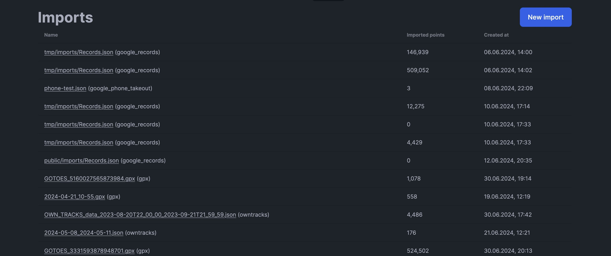

# Imports

The Imports page displays all your data imports including the number of points imported and timestamp. You can manage individual imports and create new ones.

## Viewing Imports

For each import, you can see:
- Import name (typically the filename)
- Number of points imported
- Import timestamp
- Processing status

Click on an import to view its details.

## Deleting Imports

On an import's detail page, you can delete the import.

:::warning
Deleting an import will **delete all points** that were imported from that file. This action cannot be undone.
:::

## Supported File Formats

Dawarich supports importing from various sources:

### Google Timeline

- **Records.json** - The newer format from Google Takeout
- **Location History.json** - The older format from Google Takeout
- **Semantic Location History** - Activity and place visit data

### GPS Exchange Format

- **GPX** - Standard GPS exchange format
- Supports tracks, routes, and waypoints

### GeoJSON

- **GeoJSON** - Geographic data in JSON format
- Supports Point, LineString, and FeatureCollection

### KML/KMZ (Google Earth)

- **KML** - Keyhole Markup Language files
- **KMZ** - Compressed KML archives
- Commonly exported from Google Earth and other mapping applications

### OwnTracks

- **OwnTracks JSON** - Export from OwnTracks mobile app
- Includes location history with metadata

### Strava

- **Strava exports** - Activity data from Strava
- Supports both GPX and original format exports

### Photos

- **Photos with EXIF** - Extract GPS coordinates from photo metadata
- Supports JPEG, PNG, and other formats with GPS data

### Immich/Photoprism

- Import photos with GPS data from connected photo services
- See [Photos](/docs/features/photos) for setup

## Import Processing

When you import a file:

1. The file is uploaded and queued for processing
2. Points are extracted from the file format
3. Duplicate points are automatically skipped
4. If reverse geocoding is enabled, addresses are fetched
5. You receive a notification when complete

### Processing Time

- Most imports complete within minutes
- Large files (millions of points) may take hours
- Reverse geocoding adds significant time per point

### Checking Status

Check the Sidekiq queue to monitor import progress:
- **imports** queue - File parsing
- **default** queue - Point processing and reverse geocoding

## Duplicate Prevention

Points are validated for uniqueness using:
- Coordinates (latitude/longitude)
- Timestamp

This means:
- Importing the same file twice won't create duplicates
- Your tracking app sending the same point twice won't create duplicates
- Points with slightly different timestamps are treated as separate

:::tip
Existing points will not be duplicated in the database neither with importing the same file twice nor with your client app writing a point twice. Within a user, a point is being validated for uniqueness by its coordinates and timestamp.
:::

## User Data Import

You can also import a full user data export from another Dawarich instance:

1. Export your data from the source instance (Account Settings → Export My Data)
2. On the new instance, go to Account Settings → Import My Data
3. Upload the exported file
4. All your points, settings, and metadata are imported

This is useful for:
- Migrating between instances
- Restoring from backup
- Merging accounts

## Troubleshooting

### Import seems stuck

If jobs are still in the "Enqueued" section after several hours:
1. Check the `imports` queue - if empty, the import parsing completed
2. Check the `default` queue - points may be reverse geocoding
3. See [Reverse Geocoding](/docs/self-hosting/configuration/reverse-geocoding) for rate limits

### Import failed

Check the import details page for error messages. Common issues:
- Unsupported file format
- Malformed data
- Very large files timing out

### Missing points after import

- Some file formats may not include all data types
- Points without valid timestamps are skipped
- Check if reverse geocoding is still processing

## Creating New Imports

Click **New Import** on the Imports page to upload a file. For detailed instructions, see the [Import Existing Data](/docs/getting-started/import-existing-data) tutorial.
