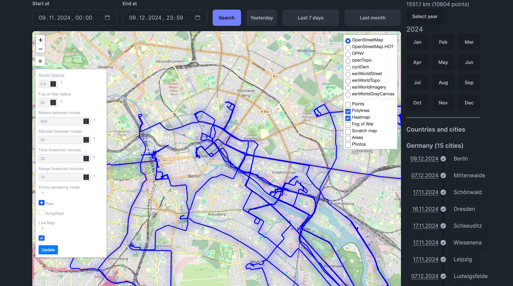
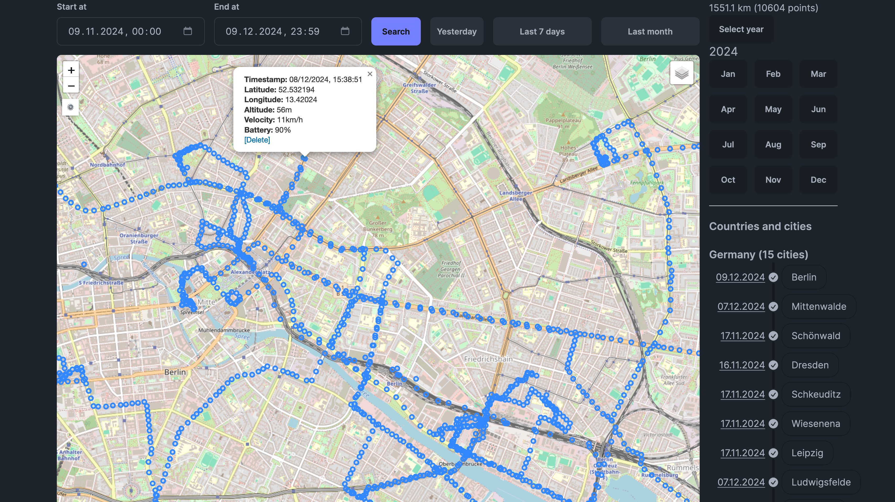
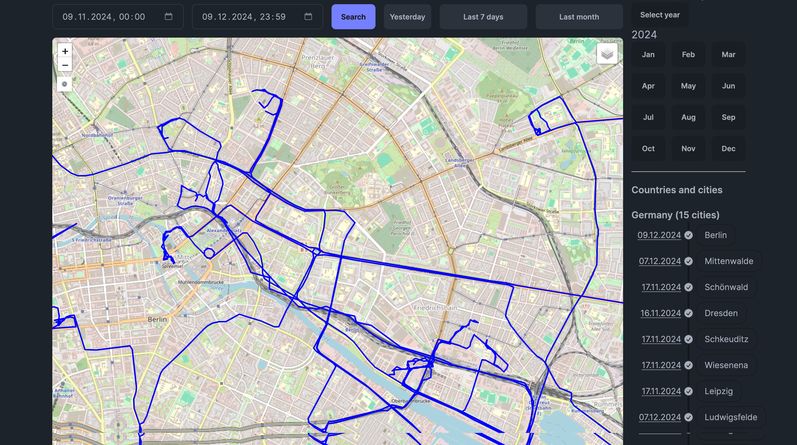
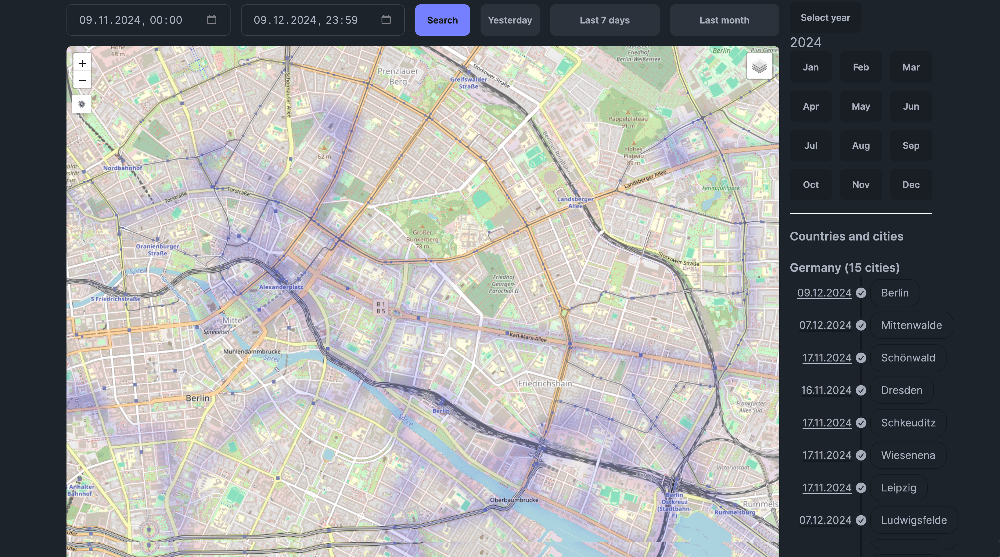
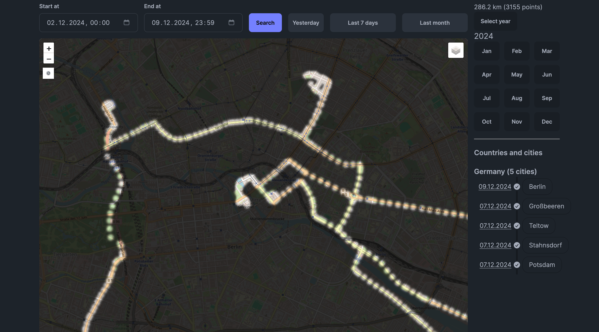
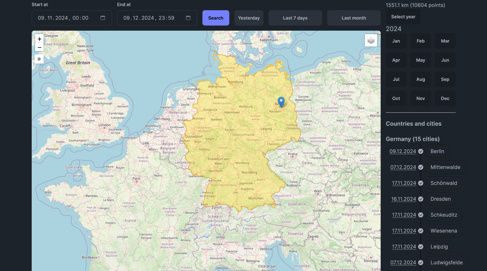
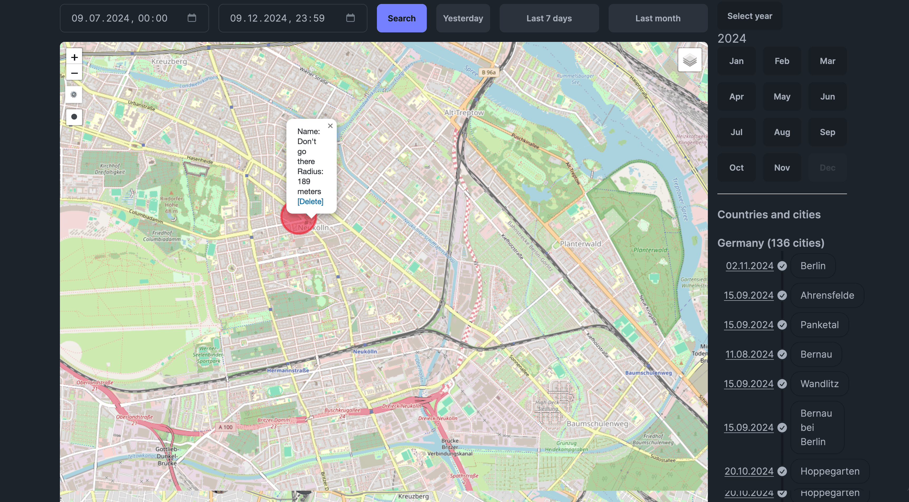

# Map

Map page features a map with visualizations of your data. You can see your points, routes, heatmap, and fog of war. You can also change the map layers and see the sidebar with your points. Points, routes, heatmap and fog of war can be toggled on and off for better visibility.

To see the details of a point, click on it. A popup will appear with the point's information. To see the details on a route, hover over it and a popup will appear with the route's information.

You can select time range for the data you want to see on the map.

In the sidebar you can find navigation by year and month, as well as a information on your visits to different countries and cities.

## Map modes and layers

You can select one of 9 default map styles. The default one is OpenStreetMap.

Map has a few optional layers:

- **Points** - shows the points on the map.
- **Polylines** - shows the routes of your points.
- **Heatmap** - shows the heatmap of your points.
- **Fog of war** - shows the fog of war of your points.
- **Scratch map** - highlights countries you've visited.
- **Areas** - enables [areas drawing on the map](/docs/features/areas) and shows existing areas you've created.
- **Photos** - shows photos from your connected [Immich and/or Photoprism](/docs/features/photos) instance.

Let's see how each of these layers looks like.

### Points

### Polylines

### Heatmap

### Fog of war

### Scratch map

### Areas

### Photos

