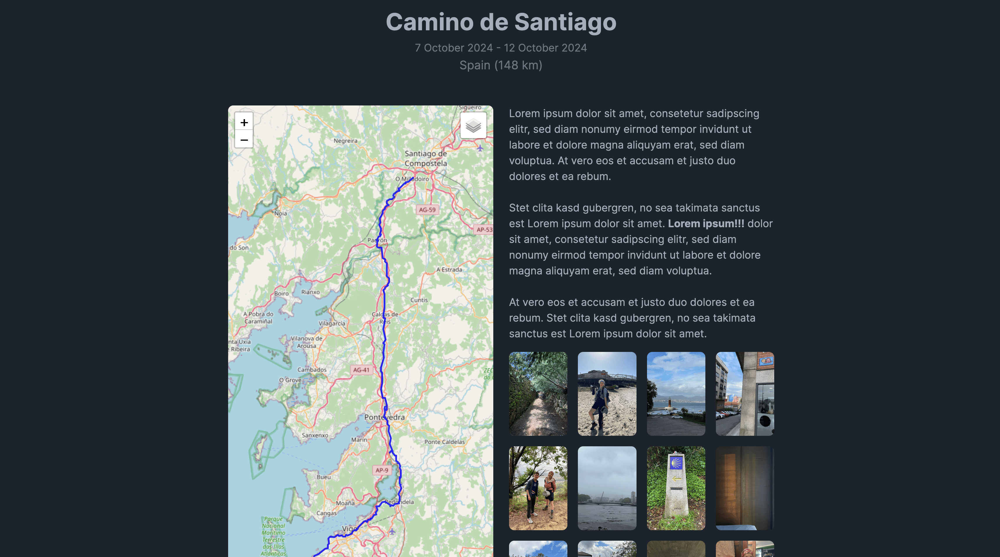

# Photos

If you're an Immich or a Photoprism user, you can configure an integration for those services with Dawarich.

The integration will allow you to see your photos on the map and in your trips. Dawarich does not store any photos, it only uses the data from your Immich or Photoprism instance.

## Configuration

In the Settings page, you can find the Photoprism and Immich integration settings. Provide URLs to your Photoprism and Immich instances, API keys for each service and click "Save".

For Immich, you need a key with an `asset.read` scope.

- How to obtain Immich API key: https://immich.app/docs/features/command-line-interface#obtain-the-api-key
- How to obtain Photoprism API key: https://docs.photoprism.app/user-guide/settings/account/#apps-and-devices

## Usage

Once the integration is configured, you will be able to see your photos on the map (when Photos layer is enabled) and in your trips.

