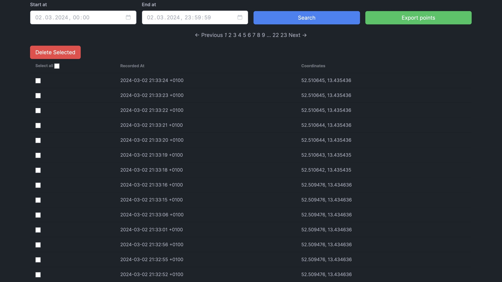

# Points

The Points page gives you a paginated table of all your recorded GPS location points. You can filter, export, and delete points from here.

## Searching and filtering

Use the filter controls at the top of the page to narrow down points by:

- **Date range** — set a start date and end date to show only points recorded within that window
- **Import source** — filter by the source that created the points (e.g. a specific import file or integration)

Click **Search** to apply the filters.

## Table columns

Each row in the table shows:

| Column | Notes |
|--------|-------|
| **Address** | Reverse-geocoded street address — only shown when reverse geocoding is enabled |
| **Speed** | Speed recorded at that point |
| **Coordinates** | Latitude and longitude |
| **Recorded at** | Timestamp when the point was recorded; click the column header to sort ascending or descending |

## Exporting points

To export the currently filtered set of points:

1. Apply your date range and source filters, then click **Search**
2. Click **Export** and choose **GeoJSON** or **GPX**

The export runs in the background. Once complete, the file is available on the [Exports](/docs/features/exports) page.

## Deleting points

To delete specific points, check the checkbox next to each row you want to remove, then confirm the deletion. Use the filter controls first to narrow down to the points you want to remove before selecting them.
