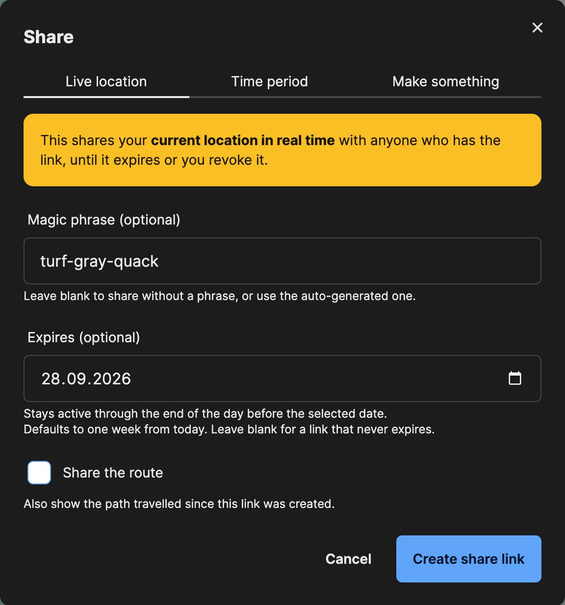
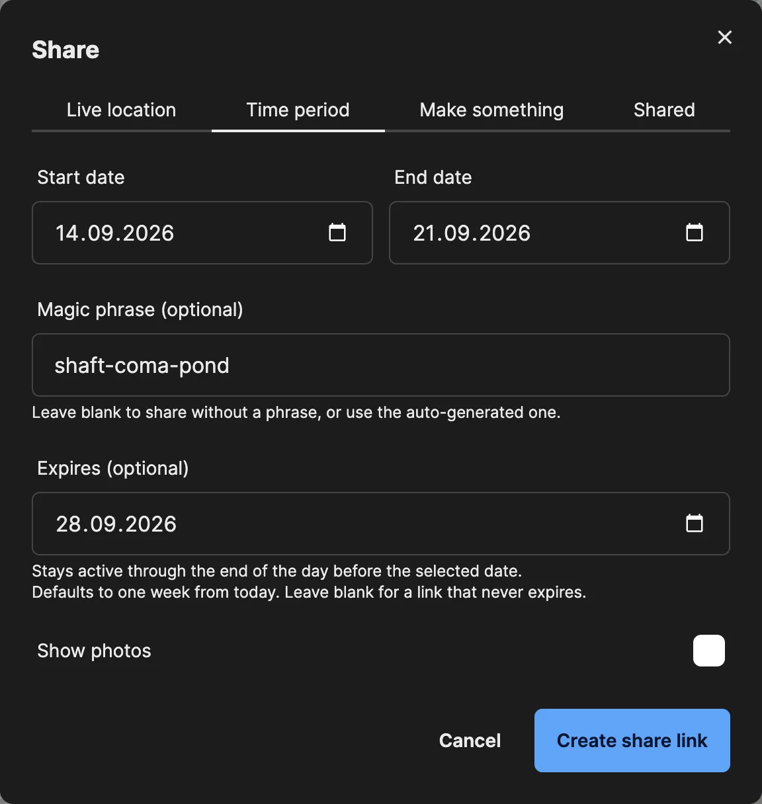
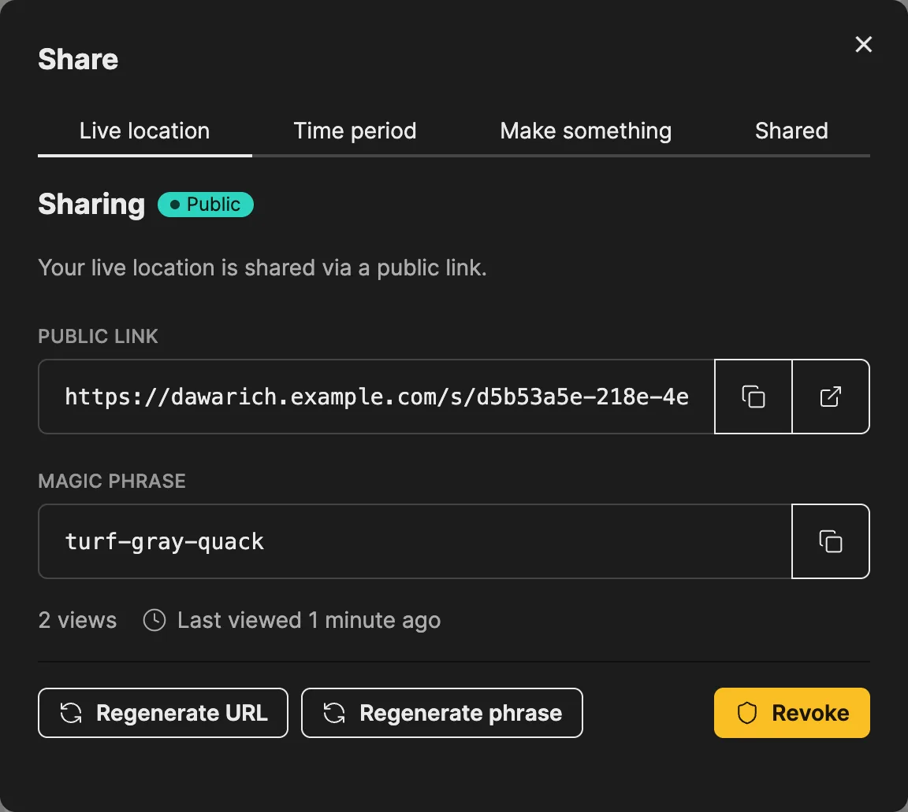
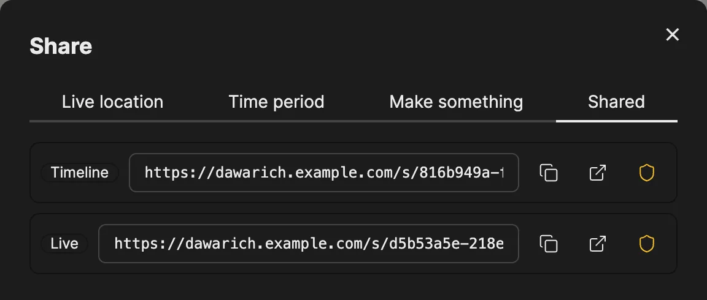
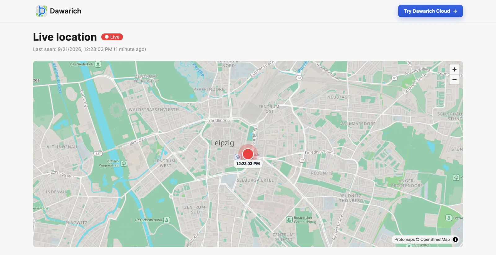
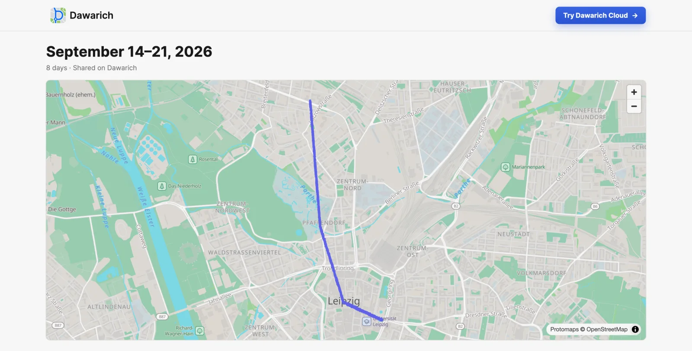

# Sharing Links

A sharing link lets anyone see one specific part of your location data in their browser, without a Dawarich account. Each link points at exactly one thing, has its own settings, and can be revoked at any time.

Sharing links are for people outside your Dawarich instance. To share your location with other Dawarich accounts on an ongoing basis, use [Family Location Sharing](/docs/features/family).

## What you can share

| What | Where to create the link | What the viewer sees |
|------|--------------------------|----------------------|
| **Live location** | Map v2 → **Share** → **Live location** | Your current position, updating in real time. Optionally the route travelled since the link was created. |
| **Time period** | Map v2 → **Share** → **Time period** | Your route between a start and an end date. Photos are optional. |
| **Trip** | A trip's page → **Share** | The trip, with the sections you pick: route map, stats and countries, day-by-day breakdown, per-day notes, description and photos. |
| **Track** | The **Share** button in a track's details in the Map v2 timeline | That single track, with optional stats and photos. |

You can have one active link of each kind at a time: one live location link, one time period link, one per trip and one per track. Creating a new link replaces the previous one of the same kind, and the old address stops working.

Monthly statistics and the year-end digest have their own, simpler sharing. See [Monthly stats and yearly digest](#monthly-stats-and-yearly-digest) below.

## Creating a link

Open **Share** on Map v2 and choose **Live location** or **Time period**. Trip and track links are created from the trip page and the track details in the same way.

Every link has the same basic settings:

- **Magic phrase (optional).** A three-word phrase is generated for you. Anyone opening the link has to enter it first. Clear the field to share without a phrase.
- **Expires (optional).** Defaults to one week from today. The link stays active through the end of the day before the selected date. Leave it blank for a link that never expires.
- **Photos start switched off**, and so does **Share the route** on live location links, so a link never shows more than you meant to.

Click **Create share link** to get the address.

## Managing your links

After you create a link, its tab shows the address, the magic phrase, how many times it was opened and when it was last viewed.

- **Regenerate URL** gives the link a new address with the same settings. The old address stops working.
- **Regenerate phrase** sets a new magic phrase. Everyone who already unlocked the link has to enter the new one.
- **Revoke** switches the link off immediately. People watching a live location link see the share end.

The **Shared** tab lists every active link in one place, with buttons to copy, open or revoke it.

## What the viewer sees

The link opens a public page in any browser. If the link has a magic phrase, the viewer enters it and clicks **Unlock** first.

A **live location** link shows your latest position and when it was recorded, and moves as new points arrive. If your latest point is more than 15 minutes old, the page shows that your location is currently unknown instead of an outdated position.

A **time period** link shows your route between the selected dates:

Trip and track links show the trip or track with the sections you enabled when creating the link.

## Privacy

- **One link, one thing.** A link only resolves to what it was created for. A time period link is limited to its dates, and there is no way from a shared page to the rest of your account.
- **Privacy zones apply.** Points inside your privacy zones (places tagged with a tag that has a privacy radius) are left out of shared routes, and a live position inside one is not shown.
- **Phrase-protected links stay private in previews.** Messengers and social networks don't get a map preview of a phrase-protected link.
- **You can stop at any time.** Revoking or regenerating a link takes effect immediately.

## Monthly stats and yearly digest

Monthly statistics and the year-end digest are shared from their own pages, with an older and simpler mechanism:

- The address contains a unique ID, and the link expires after 1 hour, 12 hours, 24 hours, 1 week or 1 month.
- There is no magic phrase and no view counter, and these links do not appear in the **Shared** tab.
- On Dawarich Cloud, public sharing of monthly statistics requires the Pro plan.

See [Public Stats Sharing](/docs/features/stats#public-stats-sharing) for the details.
