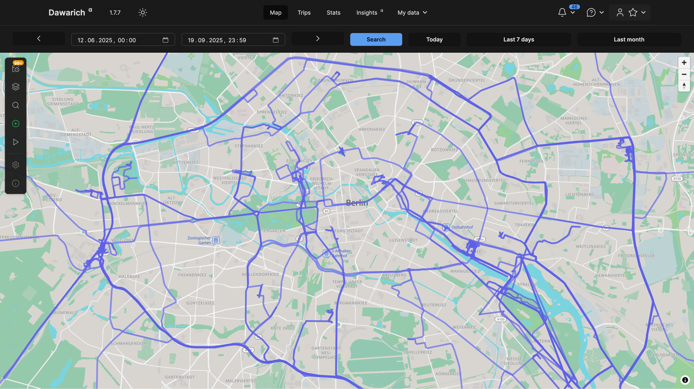

# Tracking location history

You can set up your own location tracking system using a combination of Dawarich and a mobile app. The primary and recommended way to track your location is through the **native Dawarich iOS and Android apps**, which are designed to work seamlessly with your Dawarich instance. Alternatively, you can use Overland, OwnTracks, or GPSLogger. Refer to [Track your location tutorial](/docs/getting-started/track-your-location) for more information on how to set up your own location tracking system. When a mobile application is set up to send data to Dawarich, you can see your location history on the map, as well as in the form of points and routes.

