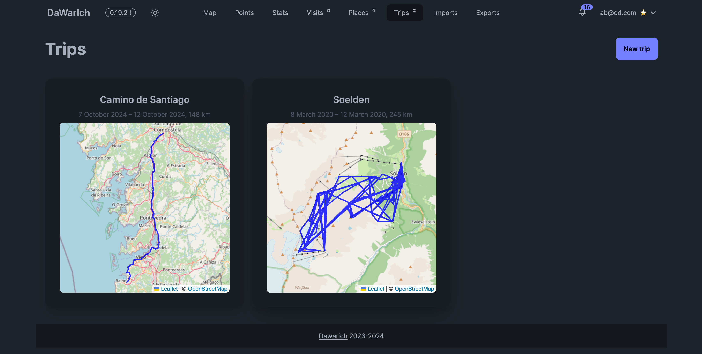

# Trips

Trips let you group your location history into named journeys with dates, notes, and a map of the route.

## Creating a trip

Click **New trip** and fill in:

- **Name** — a label for the trip (e.g. "Japan 2024")
- **Start date / End date** — the date range to include
- **Notes** — rich text field (supports formatting via the Trix editor)

Click **Create** to save. Dawarich automatically pulls in all points recorded within the date range.

## Trips list

The trips list shows all your saved trips in one place.

## Trip detail page

Clicking a trip opens the detail view, which includes:

- **Date range** — start and end dates for the trip
- **Countries visited** — a breakdown of which countries you traveled through with distance covered in each
- **Interactive map** — your route plotted on a map for the trip's date range
- **Notes** — your formatted notes for the trip
- **Photos** — thumbnail previews pulled from connected photo services (Immich or PhotoPrism), with a link to view the full set

## Editing a trip

Open a trip and click **Edit** to change the name, dates, or notes. The map updates live as you adjust the date range so you can preview which route will be included.

## Deleting a trip

Open a trip and click **Delete**. You'll be asked to confirm before the trip is removed. Deleting a trip does not delete your underlying location points.
