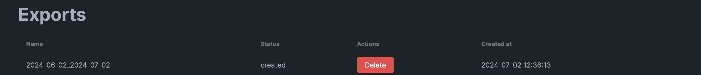

# Exporting your data

Dawarich allows you to export your data in a JSON format, structured the same way as the OwnTracks JSON format. This allows you to import your data back into Dawarich or use it in other applications.

To export your data, visit the Points page of your Dawarich instance. There you can search for points providing a time range, export them to a JSON file, and delete them. To export points, select the time range, click "Search", and then click the "Export" button. Export will be done in the background and you can find the result on the Exports page.

