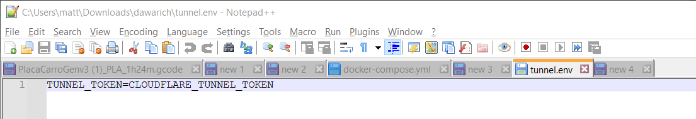

# Exposing your instance via CloudFlare Tunnel

With a couple of edits to the docker-compose.yml file, we can expose Dawarich to the internet utilizing CloudFlare and their Zero Trust Tunnel service. This will not require any firewall configuration nor ports being opened at the firewall level.

This guide will assume you already have a public domain, and are using CloudFlare DNS nameservers.

Login to CloudFlare, and navigate to "Zero Trust" on the left hand menu. https://one.dash.cloudflare.com/

Click on Networks, and then the submenu "Tunnels".
Create your tunnel.


Select cloudflared for the tunnel type on the next page.

Give your tunnel a name, and click "save tunnel".

On the next page - we are provided with the token needed to run our connector. Click on the copy button to copy this to your clipboard.


Paste this into a text editor to clean this up. We can remove the install commands, we don't need them. We just want the tunnel token. We will come back to the token in just a moment. Let's finish CloudFlare's configuration.

Click on the Public Hostname tab, and click "add a public hostname"
You can use any subdomain you'd like. Make sure to configure the IP address and port Dawarich is running on.


## Storing the token
### .env file?
<details>
      <summary>Expand to see more</summary>
If you are using a custom .env file for your Dawarich configuration, add the variable to it like this:

```
TUNNEL_TOKEN=CLOUDFLARE_TUNNEL_TOKEN
```
</details>

### directly in docker-compose.yml
see [Adding the tunnel](./expose-instance-via-cloudflare-tunnel.md#adding-the-tunnel)



Now - we are ready to modify our docker-compose file.
We need to modify the dawarich_app and dawarich sidekiq.
In both instances, add 
```
      RAILS_APPLICATION_CONFIG_HOSTS: ""
```
into the environment part and set both APPLICATION_HOSTS and APPLICATION_HOST to "dawarich.YOURDOMAIN.TLD" (or whatever you went with in the tunnel section)

## Adding the tunnel

Add the following towards the end of the dockerfile, right above where the volumes are defined:

```
  tunnel:
   image: cloudflare/cloudflared:latest
   command: tunnel --no-autoupdate run
   networks:
    - dawarich
   restart: always
   container_name: tunnel
   depends_on:
    - dawarich_app
```

If you are using a .env file, you need to add 
```
env_file: .env
```
into the tunnel section.

Should you instead want to add the token directly into the compose file, add
```
environment:
      TUNNEL_TOKEN=YOUR_TOKEN_HERE
```
into the tunnel section.


## (Re-)Starting the stack

Finally - execute a

```
docker compose up -d
```

Your instance should now be accessible via your public host name.

You can connect applications on mobile devices to utilize the API while away from home for better tracking. Tested on Android using OwnTracks.

_The original guide is written by [@mattmichaels](https://github.com/mattmichaels) and can be found [here](https://github.com/dawarich-app/site/pull/4/files)._
